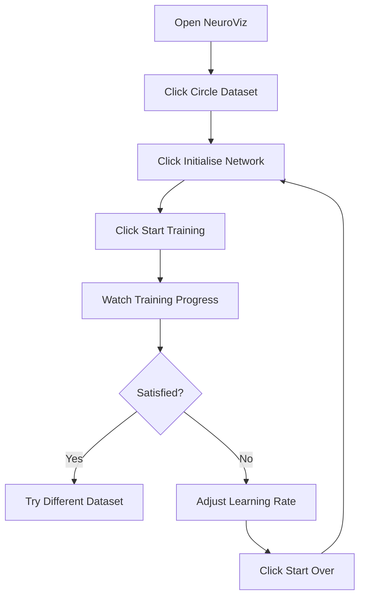
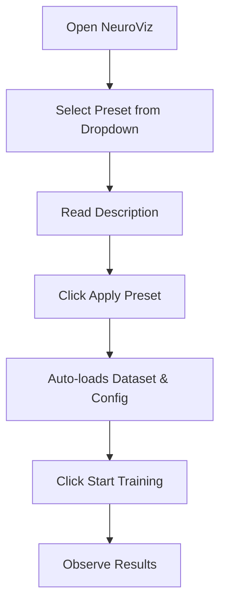
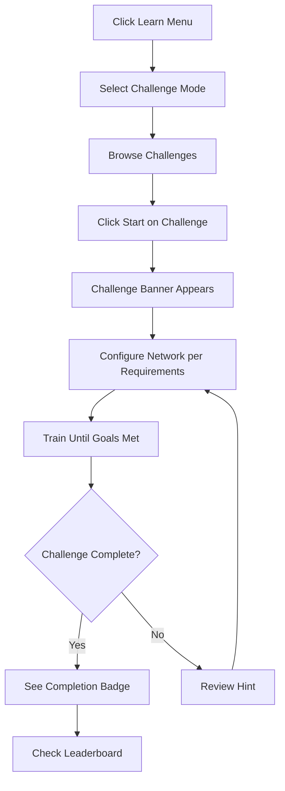
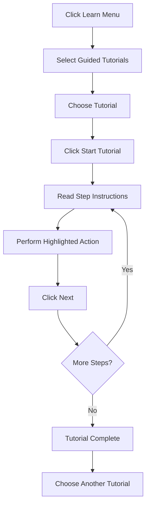
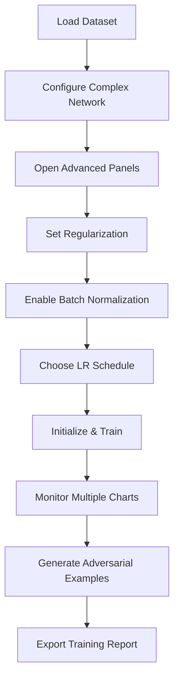
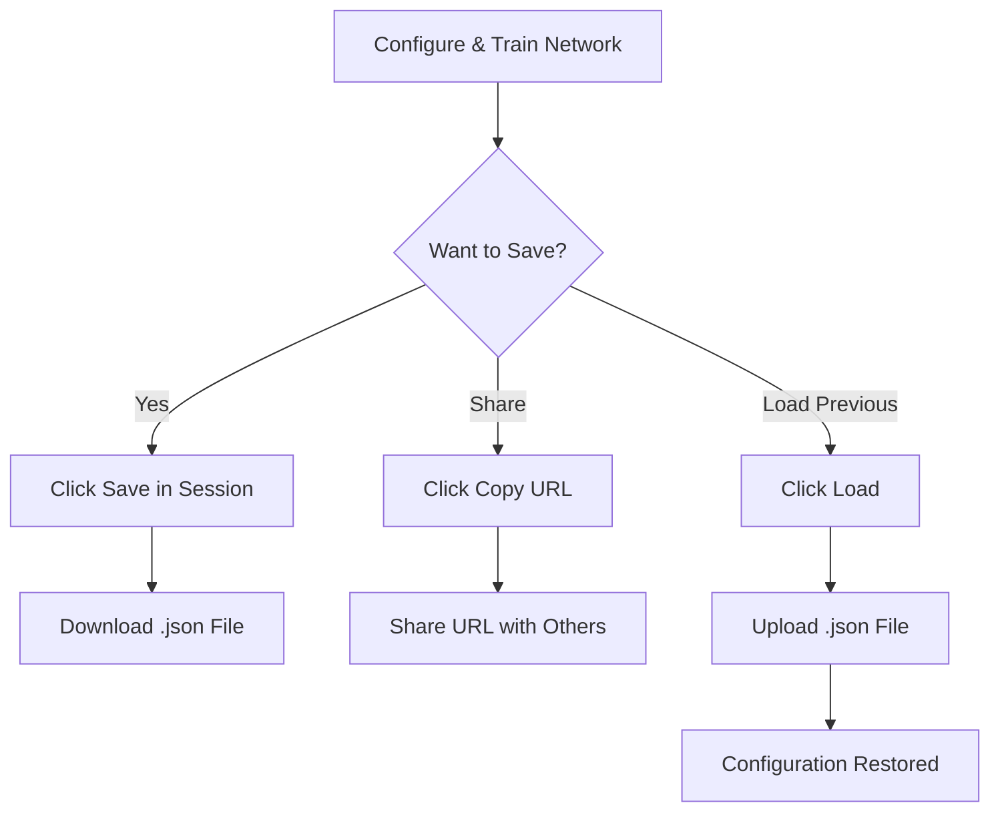

# Application Sitemap

This document maps out all screens, panels, and navigation paths in NeuroViz.

## Main Application Layout

```
┌─────────────────────────────────────────────────────────────────┐
│                        Top Navigation Bar                       │
│  [NeuroViz Logo] [Help] [Fullscreen] [Learn ▼] [Theme Toggle]  │
└─────────────────────────────────────────────────────────────────┘
┌───────────┬───────────────────────────────────┬─────────────────┐
│           │                                   │                 │
│   Left    │         Center Canvas             │     Right       │
│   Panel   │         & Controls                │     Panel       │
│           │                                   │                 │
│ Datasets  │  [Training Status Bar]            │ Hyperparameters │
│ Presets   │  [Visualization Canvas]           │ Training Config │
│ Session   │  [Learning Rate Chart]            │ Advanced Tools  │
│           │  [Training History Chart]         │ Export          │
│           │                                   │                 │
└───────────┴───────────────────────────────────┴─────────────────┘
```

## Navigation Hierarchy

### 1. Top Navigation Bar (Always Visible)

```
Top Bar
├── NeuroViz Logo
├── Help Button [?]
│   └── Opens: Keyboard Shortcuts Modal
├── Fullscreen Toggle [⛶]
│   └── Action: Enter/Exit fullscreen mode
├── Learn Menu Dropdown [▼]
│   ├── Guided Tutorials
│   │   └── Opens: Tutorials Modal
│   ├── Challenge Mode
│   │   └── Opens: Challenges Modal
│   └── Keyboard Shortcuts [?]
│       └── Opens: Keyboard Shortcuts Modal
└── Theme Toggle [☀/☾]
    └── Action: Switch light/dark theme
```

### 2. Left Panel (Datasets & Session)

```
Left Panel
├── Quick Start (Presets)
│   ├── Preset Dropdown
│   │   ├── Quick Demo
│   │   ├── Deep Network
│   │   ├── High Accuracy
│   │   └── Overfit Demo
│   ├── Preset Description (dynamic text)
│   └── [Apply Preset] Button
│
├── Dataset Section
│   ├── Dataset Gallery (2x4 Grid)
│   │   ├── Circle
│   │   ├── XOR
│   │   ├── Spiral
│   │   ├── Gaussian
│   │   ├── Clusters
│   │   ├── Iris
│   │   ├── Wine
│   │   └── Draw (Custom)
│   │
│   ├── Dataset Options
│   │   ├── Samples Slider (50-500)
│   │   ├── Noise Slider (0-50%)
│   │   ├── Class Balance Slider (10-90%)
│   │   └── Preprocessing Dropdown
│   │       ├── None
│   │       ├── Normalize
│   │       └── Standardize
│   │
│   ├── [Fetch] Button
│   ├── [CSV Upload] Button
│   │
│   ├── Draw Controls (Custom dataset only)
│   │   ├── Class Color Buttons
│   │   └── [Clear Points] Button
│   │
│   └── Dataset Statistics Panel
│       ├── Total Samples
│       ├── Class Distribution
│       └── Outlier Detection
│
└── Session Management
    ├── [Save] Button → Downloads .json file
    ├── [Load] Button → Uploads .json file
    ├── [Copy] Button → Copies config URL
    └── [Paste] Button → Loads shared config
```

### 3. Center Panel (Visualization & Charts)

```
Center Panel
├── Training Status Bar
│   ├── Epoch Counter
│   ├── Loss Display
│   ├── Accuracy Display
│   └── Playback Controls
│       ├── [Start Over] Button (Reset)
│       ├── [Step] Button (Single epoch)
│       ├── [Start/Pause] Button
│       ├── [Undo] Button (Config history)
│       └── [Redo] Button (Config history)
│
├── Visualization Canvas
│   ├── Data Points (colored dots)
│   ├── Decision Boundary (colored background)
│   ├── 3D View Container (optional)
│   ├── Gradient Flow Container (optional)
│   │
│   └── Footer Overlays (bottom of canvas)
│       ├── Left: Metric Cards
│       │   └── Validation Loss
│       └── Right: View Controls
│           ├── [Weights] Toggle → Shows network weights
│           ├── [Voronoi] Toggle → Shows Voronoi diagram
│           └── [3D Mode] Toggle → Switches to 3D view
│
├── Learning Rate Chart
│   └── Timeline showing LR changes
│
└── Training History Chart
    ├── Header Stats
    │   ├── Best Loss
    │   ├── Best Accuracy
    │   └── Improvement Percentage
    └── Dual-axis Chart
        ├── Loss curve (orange)
        └── Accuracy curve (green)
```

### 4. Right Panel (Configuration & Analysis)

```
Right Panel
├── Hyperparameters
│   ├── Learning Rate Input
│   ├── Optimizer Dropdown
│   │   ├── Adam
│   │   ├── SGD
│   │   └── RMSprop
│   ├── Loss Function Dropdown
│   │   ├── Cross Entropy
│   │   ├── MSE
│   │   └── Hinge
│   ├── Batch Normalization Toggle
│   ├── Hidden Layers Input (e.g., "8, 4")
│   ├── Activation Dropdown
│   │   ├── ReLU
│   │   ├── Tanh
│   │   └── Sigmoid
│   ├── Output Classes Dropdown
│   │   ├── Binary (2)
│   │   ├── 3 Class
│   │   └── 4 Class
│   └── [Initialise Network] Button
│
├── Training Config
│   ├── Batch Size Input
│   ├── Max Epochs Input
│   ├── Speed (FPS) Slider (1-60)
│   ├── Performance Mode Dropdown
│   │   ├── Full Speed (60 FPS)
│   │   ├── Balanced (30 FPS)
│   │   └── Battery Saver (15 FPS)
│   └── LR Schedule Dropdown
│       ├── None (Constant)
│       ├── Step Decay
│       ├── Exponential Decay
│       └── Cosine Annealing
│
├── Advanced (Collapsible Accordions)
│   ├── Regularization ▼
│   │   ├── L1 Regularization
│   │   ├── L2 Regularization
│   │   └── Dropout Rate
│   │
│   ├── Network Diagram ▼ [Open by default]
│   │   └── Visual network architecture
│   │
│   ├── Weight Distribution ▼
│   │   └── Histogram of weight values
│   │
│   ├── Confusion Matrix ▼
│   │   ├── Matrix visualization
│   │   └── Metrics (F1, Precision, Recall)
│   │
│   ├── Layer Activations ▼
│   │   └── Histogram of activation values
│   │
│   ├── Model Complexity ▼ [Open by default]
│   │   ├── Parameters Count
│   │   ├── FLOPs per Forward Pass
│   │   ├── Memory Usage (Params)
│   │   ├── Memory Usage (Activations)
│   │   ├── Total Memory
│   │   └── Complexity Rating
│   │
│   ├── Adversarial Examples ▼
│   │   ├── [Generate] Button
│   │   ├── Results List
│   │   └── [Clear] Button
│   │
│   └── Training Speed ▼
│       ├── Current Speed Display
│       ├── Baseline Comparison
│       ├── [Save Baseline] Button
│       └── [Clear Baseline] Button
│
└── Export Tools
    ├── [Export Model] Button
    ├── [Export Stats] Button
    └── [Export Training Report] Button
```

## Modal Dialogs & Overlays

### Tutorials Modal

```
Tutorials Modal
├── Header
│   ├── Title: "Guided Tutorials"
│   └── [Close] Button
└── Tutorial List
    ├── Tutorial Card: "What is a Decision Boundary?"
    │   ├── Difficulty: Beginner
    │   ├── Duration: 3 min
    │   ├── Category: Concepts
    │   └── [Start Tutorial] Button
    ├── Tutorial Card: "Why Does Learning Rate Matter?"
    │   ├── Difficulty: Beginner
    │   ├── Duration: 5 min
    │   ├── Category: Concepts
    │   └── [Start Tutorial] Button
    └── Tutorial Card: "Understanding Overfitting"
        ├── Difficulty: Intermediate
        ├── Duration: 6 min
        ├── Category: Concepts
        └── [Start Tutorial] Button
```

**Active Tutorial Overlay** (appears when tutorial is running):
- Tutorial progress indicator
- Step instructions
- Highlighted UI elements
- [Next] / [Skip Tutorial] buttons

### Challenges Modal

```
Challenges Modal
├── Header
│   ├── Title: "Challenge Mode"
│   ├── Total Points Display
│   └── [Close] Button
├── Tab Navigation
│   ├── [Challenges] Tab (Active)
│   └── [Leaderboard] Tab
└── Challenges Tab Content
    ├── Challenge Card: "XOR Speed Run"
    │   ├── Difficulty: Easy
    │   ├── Points: 100
    │   ├── Description
    │   ├── Dataset: xor
    │   ├── Hint
    │   └── [Start] Button
    ├── Challenge Card: "Minimal Spiral"
    │   ├── Difficulty: Medium
    │   ├── Points: 200
    │   └── [Start] Button
    └── ... (7 total challenges)
```

**Leaderboard Tab Content**:
- Ranked list of your best attempts
- Configuration details
- Scores and metrics

**Active Challenge Banner** (appears at top when challenge active):
- Challenge name
- Current status
- [Abandon] button

### Keyboard Shortcuts Modal

```
Keyboard Shortcuts Modal
├── Header
│   ├── Title: "Keyboard Shortcuts"
│   └── [Close] Button
└── Sections
    ├── Training Controls
    │   ├── Space → Start/Pause
    │   ├── S → Step One Epoch
    │   ├── R → Reset Training
    │   └── Esc → Pause
    ├── Configuration
    │   ├── Ctrl+Z → Undo Config
    │   └── Ctrl+Y → Redo Config
    ├── Datasets
    │   ├── 1 → Circle Dataset
    │   ├── 2 → XOR Dataset
    │   ├── 3 → Gaussian Dataset
    │   ├── 4 → Spiral Dataset
    │   └── 5 → Moons Dataset
    └── View
        ├── F → Toggle Fullscreen
        └── ? → Show This Help
```

## User Workflows & Navigation Paths

### Workflow 1: Beginner First Use



### Workflow 2: Using Presets



### Workflow 3: Challenge Mode



### Workflow 4: Tutorial Learning



### Workflow 5: Advanced Experimentation



### Workflow 6: Session Management



## Breadcrumb Trails

NeuroViz is a single-page application, so traditional breadcrumbs don't apply.
However, state can be tracked through:

### Configuration History (Undo/Redo)
- Each configuration change is tracked
- Use Undo (Ctrl+Z) to step back through changes
- Use Redo (Ctrl+Y) to step forward
- Visual indicators show when undo/redo is available

### Training State
```
Not Initialized → Initialized → Training → Paused → Completed
     ↓               ↓            ↓          ↓         ↓
  [Load Data]   [Init Network] [Start]   [Pause]   [Reset]
```

### Tutorial Progress
When a tutorial is active:
```
Tutorial Started → Step 1/7 → Step 2/7 → ... → Step 7/7 → Complete
```

### Challenge Progress
When a challenge is active:
```
Challenge Started → Training → Goals Met? → Complete / Try Again
```

## Quick Reference: Finding Features

| What I Want To Do | Where To Find It |
|-------------------|------------------|
| Load a dataset | Left Panel → Dataset Gallery |
| Change network layers | Right Panel → Hyperparameters → Hidden Layers |
| Start training | Center → Training Status Bar → Start Button |
| Pause training | Center → Training Status Bar → Pause Button |
| See training progress | Center → Training Status Bar (top numbers) |
| View training charts | Center → Training History Chart (bottom) |
| Change learning rate | Right Panel → Hyperparameters → Learning Rate |
| Use a preset config | Left Panel → Quick Start → Preset Dropdown |
| Save my work | Left Panel → Session → Save Button |
| Export a report | Right Panel → Export Tools → Export Training Report |
| View keyboard shortcuts | Top Bar → Learn → Keyboard Shortcuts |
| Start a tutorial | Top Bar → Learn → Guided Tutorials |
| Try a challenge | Top Bar → Learn → Challenge Mode |
| Toggle 3D view | Center → Canvas → View Controls → 3D Mode |
| See model complexity | Right Panel → Advanced → Model Complexity |
| Generate adversarial examples | Right Panel → Advanced → Adversarial Examples |
| Adjust regularization | Right Panel → Advanced → Regularization |
| Change theme | Top Bar → Theme Toggle (sun/moon icon) |
| Go fullscreen | Top Bar → Fullscreen Toggle |

## Mobile/Touch Navigation

On smaller screens:
- Panels may stack vertically
- Some advanced features collapse into accordions
- Touch gestures may be enabled for canvas interaction
- Learn menu becomes more prominent for mobile-first education

---

**Navigation Tips:**
- Hover over buttons to see tooltips with descriptions
- Press **?** anywhere to see keyboard shortcuts
- UI elements are disabled until their prerequisites are met (e.g., can't train
  without initializing network)
- Visual indicators (glow, color changes) guide you to the next action
